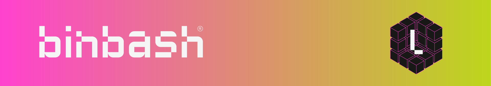

{: style="width:800px"}

# Overview
Welcome to Leverage's documentation! Here you will find the concepts you need to understand to work with our stack, the steps to try Leverage for yourself, and extensive documentation about every aspect of our solution.

# Getting Started
Feel free to explore the following pages to know more about Leverage.

:books: See [**What is Leverage**](../concepts/what-is-leverage.md) to fully understand what Leverage is.

:books: See [**Why Leverage**](../concepts/why-leverage.md) to help you decide whether Leverage is the right tool for you.

:books: See [**Our Tech Stack**](../concepts/our-tech-stack.md) to learn about our design choices for the technology stack.

:books: See [**Try Leverage**](../try-leverage/introduction.md) to take the tutorial that will help you deploy a basic AWS Landing Zone via Leverage.