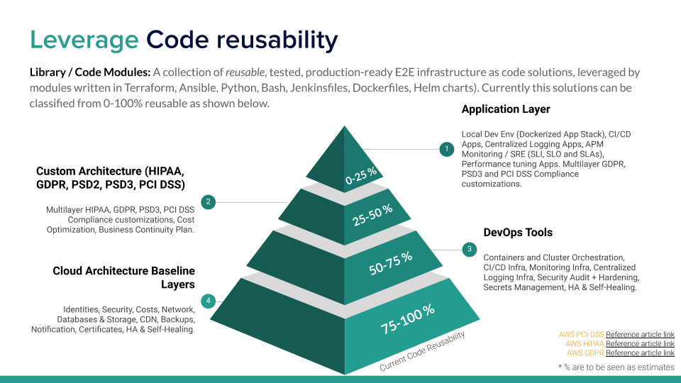

# Leverage DevOps Automation Code Library

## Overview
A collection of reusable, tested, production-ready E2E
infrastructure as code solutions, leveraged by modules written in Terraform, Ansible, Jenkinsfiles, 
Dockerfiles, Helm charts and Makefiles).

### Model

Our development model is strongly based on code reusability 
{: style="width:750px"}

### Reusability
High level summary of the the code reusability efficiency  
{: style="width:750px"}

!!! important "Considerations"
    :warning: Above detailed `%` are to be seen as estimates 
    
    - :cloud: :lock: [AWS PCI-DSS Reference article](https://aws.amazon.com/quickstart/architecture/compliance-pci/)
    - :cloud: :lock: [AWS HIPAA Reference article](https://aws.amazon.com/compliance/hipaa-compliance/)
    - :cloud: :lock: [AWS GDPR Reference article](https://aws.amazon.com/compliance/gdpr-center/)

### Modules
DevOps Automation Code Library development and implementation workflow  
{: style="width:850px"}

