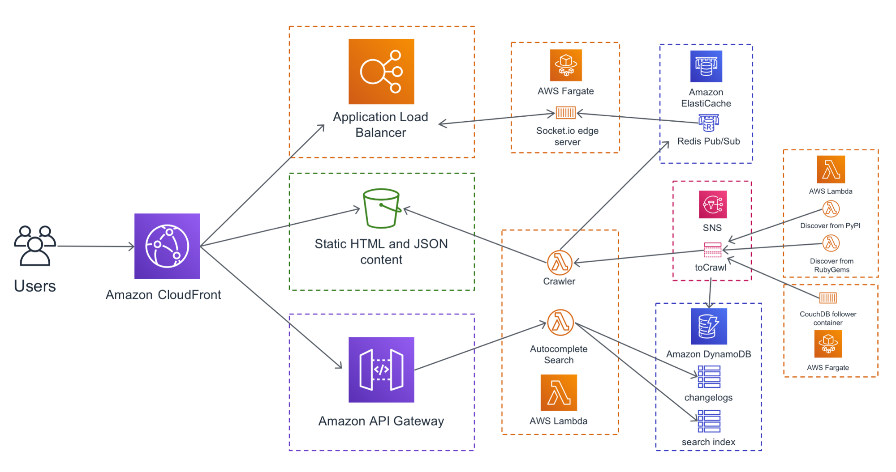

# Serverless Compute

As stated by [AWS Serverless definitions](https://aws.amazon.com/serverless/)

!!! quote "What is serverless?"
    Serverless is the native architecture of the cloud that enables you to shift more of your operational
    responsibilities to AWS, increasing your agility and innovation. Serverless allows you to build and run applications
    and services without thinking about servers. It eliminates infrastructure management tasks such as server or cluster
    provisioning, patching, operating system maintenance, and capacity provisioning. You can build them for nearly any
    type of application or backend service, and everything required to run and scale your application with high
    availability is handled for you.

!!! quote "Why use serverless?"
    Serverless enables you to build modern applications with increased agility and lower total cost of ownership. 
    Building serverless applications means that your developers can focus on their core product instead of worrying
    about managing and operating servers or runtimes, either in the cloud or on-premises. This reduced overhead lets
    developers reclaim time and energy that can be spent on developing great products which scale and that are reliable.

{: style="width:950px"}

<figcaption style="font-size:15px">
<b>Figure:</b> AWS serverless architecture diagram (just as reference).
(Source: Nathan Peck, 
<a href="https://medium.com/containers-on-aws/designing-a-modern-serverless-application-with-aws-lambda-and-aws-fargate-83f4c5fac573">
"Designing a modern serverless application with AWS Lambda and AWS Fargate"</a>,
Containers-on-AWS Medium Blog post, accessed November 18th 2020).
</figcaption>

!!! info "Serverless Compute {: style="width:30px"} Services"
    * [x] [AWS Lambda](https://aws.amazon.com/lambda/) lets you run code without provisioning or managing servers. 
    You pay only for the compute time you consume - there is no charge when your code is not running. 
    * [x] [Lambda@Edge](https://aws.amazon.com/lambda/edge/) allows you to run Lambda functions at AWS Edge locations in
    response to Amazon CloudFront events.
    * [x] [AWS Fargate](https://aws.amazon.com/fargate/) is a purpose-built serverless compute engine for containers.
     Fargate scales and manages the infrastructure required to run your containers.