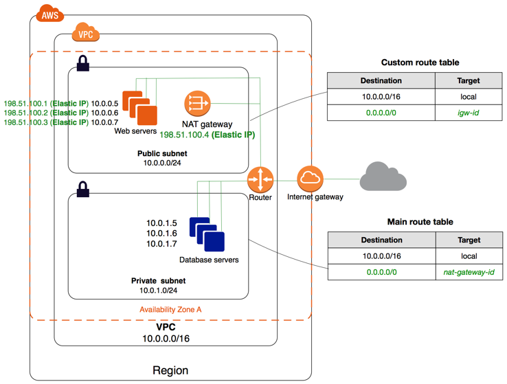
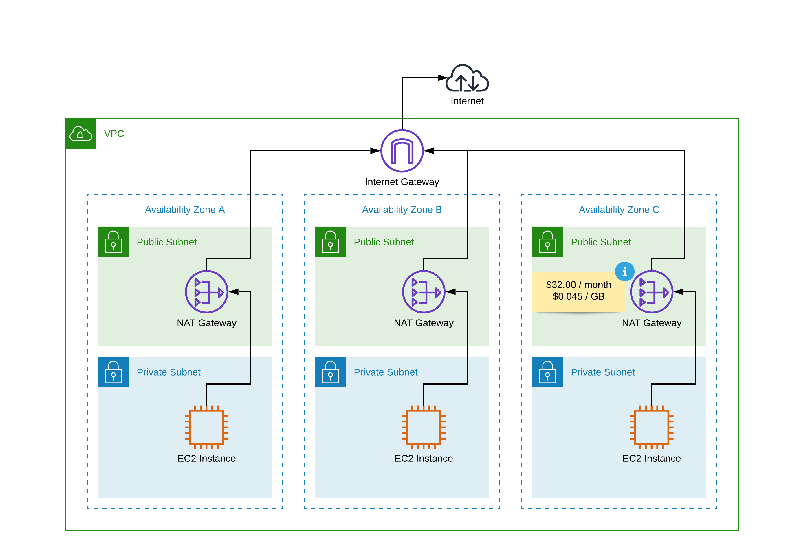

# Network Layer

## Network Topology

!!! summary "VPC with public and private subnets (NAT)"
    * [x] The configuration for this scenario includes a virtual private cloud (VPC) with public subnets and a private 
    subnets (it's number will change depending on our specific needs). We recommend this scenario if you want 
    to run a public-facing web application, while maintaining back-end servers that aren't publicly accessible. 
    A common example is a multi-tier website, with a Load Balancer (ALB | NLB) in a public subnet, or other public
    facing routing service like AWS CloudFront or Api Gateway, and our web servers (Lambda, EKS, ECS, EC2) and 
    database (RDS, DynamoDB, etc) servers in private subnets. You can set up security (SGs, ACLs, WAF) and routing 
    so that the web servers can communicate internally (even between VPC accounts or VPN Endpoints) with all necessary 
    services and components such as databases, cache, queues, among others.

    * [x] The services running in the public subnet, like an ALB or NLB can send outbound traffic directly to the Internet, 
    whereas the instances in the private subnet can't. Instead, the instances in the private subnet can access the 
    Internet by using a network address translation (NAT) gateway that resides in the public subnet. The database 
    servers can connect to the Internet for software updates using the NAT gateway (if using RDS this is transparently
    provided by AWS), but the Internet cannot establish connections to the database servers.
    
    * [x] So, whenever possible all our AWS resources like EC2, EKS, RDS, Lambda, SQS will be deployed in VPC private
     subnets and we'll use a NAT device (Nat Gateway) to enable instances in a private subnet to connect to the 
     internet (for example, for software updates) or other AWS services, but prevent the internet from initiating
     connections with the instances. 
    
    * [x] A NAT device forwards traffic from the instances in the private subnet to the internet (via the VPC Internet
    Gateway) or other AWS services, and then sends the response back to the instances. When traffic goes to the 
    internet, the source IPv4 address is replaced with the NAT device’s address and similarly, when the response
    traffic goes to those instances, the NAT device translates the address back to those instances’ private IPv4
    addresses.

{: style="width:900px"}
<figcaption style="font-size:15px">
<b>Figure:</b> VPC topology diagram.
(Source: AWS, 
<a href="https://docs.aws.amazon.com/vpc/latest/userguide/VPC_Scenario2.html">
"VPC with public and private subnets (NAT)"</a>,
AWS Documentation Amazon VPC User Guide, accessed November 18th 2020).
</figcaption>

{: style="width:900px"}
<figcaption style="font-size:15px">
<b>Figure:</b> VPC topology diagram with multiple Nat Gateways for HA.
(Source: Andreas Wittig, 
<a href="https://cloudonaut.io/advanved-aws-networking-pitfalls-that-you-should-avoid/">
"Advanced AWS Networking: Pitfalls That You Should Avoid"</a>,
Cloudonaut.io Blog, accessed November 18th 2020).
</figcaption>

## Read more

!!! info "AWS reference links"
    Consider the following AWS official links as reference:
        
    - :orange_book: [**VPC with public and private subnets (NAT)**](https://docs.aws.amazon.com/vpc/latest/userguide/VPC_Scenario2.html)
    - :orange_book: [**AWS Elastic Load Balancing**](https://aws.amazon.com/elasticloadbalancing)
