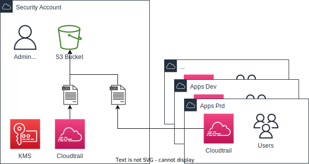

# Audit | CloudTrail

## Feature Overview 

AWS CloudTrail monitors and records account activity across your AWS infrastructure, 
giving you control over storage, analysis, and remediation actions.

!!! info "AWS CloudTrail overview"
    This service will be configured to enable auditing of all AWS services in all accounts.
    Once enabled, as shown in the below presented figure, CloudTrail will deliver all events 
    from all accounts to the Security account in order to have a centralized way to audit 
    operations on AWS resources.
    Audit events will be available from CloudTrail for 90 days but a longer retention 
    time will be available through a centralized S3 bucket.

<figure markdown>
  { width="600" }
    <figcaption style="font-size:15px">
    <b>Figure:</b> AWS CloudTrail components architecture diagram (just as reference).
    (Source: Binbash Leverage diagrams, accessed July 6th 2022).
    </figcaption>
</figure>

!!! example "{: style="width:25px"} IaC Terraform Codebase <>"
    - [x] `binbash-management` account | Audit: Cloudtrail
        - **Code:** [management/us-east-1/security-audit](https://github.com/binbashar/le-tf-infra-aws/tree/master/management/us-east-1/security-audit)
    - [x] `binbash-security` account | Audit: Cloudtrail & S3 Bucket
        - **Code:** [security/us-east-1/security-audit](https://github.com/binbashar/le-tf-infra-aws/tree/master/security/us-east-1/security-audit)
    - [x] `binbash-shared` account | Audit: Cloudtrail
        - **Code:** [shared/us-east-1/security-audit](https://github.com/binbashar/le-tf-infra-aws/tree/master/shared/us-east-1/security-audit)
    - [x] `binbash-apps-devstg` account | Audit: Cloudtrail
        - **Code:** [apps-devstg/us-east-1/security-audit](https://github.com/binbashar/le-tf-infra-aws/tree/master/apps-devstg/us-east-1/security-audit)
    - [x] `binbash-apps-prd` account | Audit: Cloudtrail
        - **Code:** [apps-prd/us-east-1/security-audit](https://github.com/binbashar/le-tf-infra-aws/tree/master/apps-prd/us-east-1/security-audit)
    - [x] `binbash-network` account | Audit: Cloudtrail
        - **Code:** [network/us-east-1/security-audit](https://github.com/binbashar/le-tf-infra-aws/tree/master/network/us-east-1/security-audit)

## Read more

!!! info "AWS reference links"
    Consider the following AWS official links as reference:
    
    * :orange_book: [AWS Cloudtrail Overview](https://aws.amazon.com/cloudtrail/)
