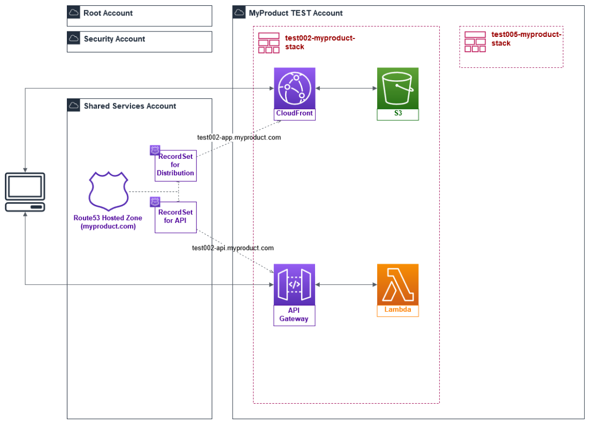

# Route53 DNS hosted zones

!!! info "{: style="width:30px"} {: style="width:20px"} Route53 Considerations"
     - [x] **Route53** private hosted zone will have associations with VPCs on different AWS organization accounts
     - [x] **Route53** should ideally be hosted in the Shared account, although sometimes Route53 is already deployed in a Legacy
        account where it can be imported and fully supported as code.
     - [x] **Route53** [zero downtime migration](https://docs.aws.amazon.com/Route53/latest/DeveloperGuide/hosted-zones-migrating.html) 
        (active-active hosted zones) is completely possible and achieviable with Leverage terraform code    
        
{: style="width:800px"}
<figcaption>**Figure:** AWS multi account Organization 
[Route53 Association](https://aws.amazon.com/blogs/security/how-to-centralize-dns-management-in-a-multi-account-environment/)
topology (just as reference).</figcaption>