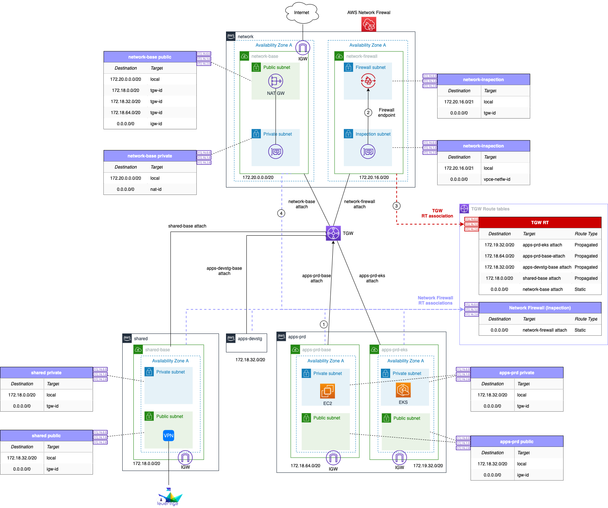

# Network Security 
## Control Internet access outbound traffic

### Goals
- [x] Review and analyse available alternatives for controlling outbound traffic in VPCs.
- [x] All possible candidates need to offer a reasonable balance between features and pricing.

!!! important "Solutions"
    ### Leverage currently supports 
    - Network ACL (Subnet firewall)
    - Security Groups (Instance firewall)
    
    ### What alternatives do we have?
    #### Pre-considerations
    First of all, keep in mind the following points before and while you go through the data in the table:
    
    - 1 EBS pricing at the moment of this writing:
      - GP2: $0.10 per GB-month
      - GP3: $0.08 per GB-month)
    
    - 2 DataTransfer costs will be incurred in all options

### Dedicated Network NAT-GW + Network Firewall Account

[Centralized Network Firewall deployment model](https://aws.amazon.com/blogs/networking-and-content-delivery/deployment-models-for-aws-network-firewall/),
North-South: Centralized internet egress (VPC to internet via Transit Gateway) and NAT gateway.

{: style="width:1600px"}
<figcaption style="font-size:15px">
<b>Figure:</b> Multi-account dedicated network transit gateway + network firewall architecture diagram.
(Source: Binbash Leverage,
"Lereverage Reference Architecture dedicated network account TGW + NFW implementation",
Binbash Leverage Doc, accessed August 4th 2021).
</figcaption>

## Comparison of the alternatives analysed

!!! info "Leverage Confluence Documentation"    
    You'll find [**here**](https://binbash.atlassian.net/wiki/external/1782644772/NmVhZjliOWRiMWJjNGU0MGExNmQ0Zjc3M2NiYTgzYmQ?atlOrigin=eyJpIjoiZjc2M2I5YmM1OWJmNGUxN2E0OWZlMDkzZGViNzJjMmQiLCJwIjoiYyJ9) 
    a detailed comparison table including the alternative product and solution types, pricing model, features, pros & cons.