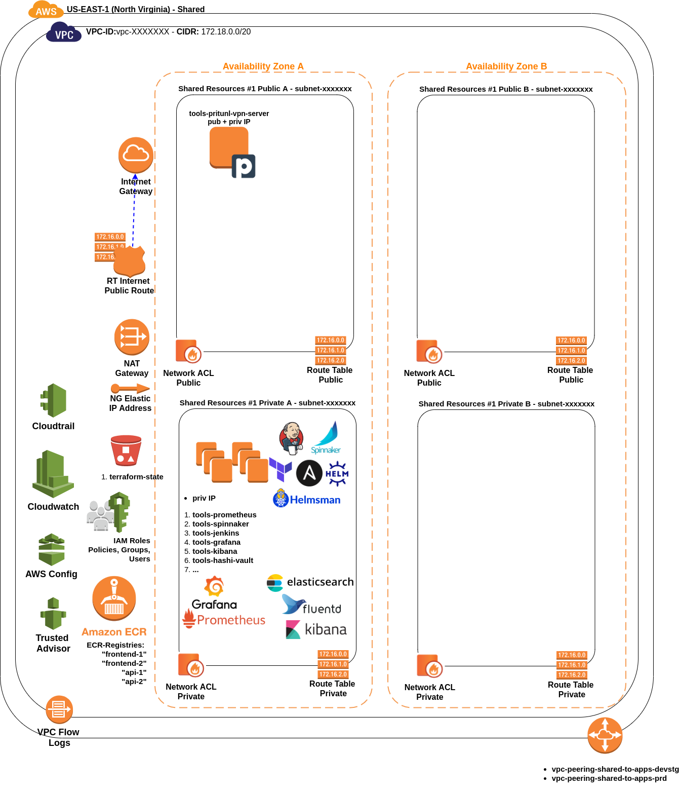

# AWS Organization Accounts description
Our default AWS Organizations terraform layout solution includes `5 accounts + 1` or **N Accts** (if you invite pre-existing AWS Account/s).

| Account                     | Description                                                                                                                                                                                                                                                                                |
|-----------------------------|--------------------------------------------------------------------------------------------------------------------------------------------------------------------------------------------------------------------------------------------------------------------------------------------|
| Root Organizations          | Used to manage configuration and access to AWS Org managed accounts. The AWS Organizations account provides the ability to create and financially manage member accounts, it contains AWS Organizations Service Control Policies(SCPs).                                                    |
| Shared Services / Resources | Reference for creating infrastructure shared services such as directory services, DNS, VPN Solution, Monitoring tools like Prometheus and Grafana, CI/CD server (Jenkins, Drone, Spinnaker, etc), centralized logging solution like ELK  and Vault Server (Hashicorp Vault)               |
| Security                    | Intended for centralized user management via IAM roles based cross-org auth approach (IAM roles per account to be assumed still needed. Also to centralize AWS CloudTrail and AWS Config logs, and used as the master AWS GuardDuty Account                                               |
| Legacy                      | Your pre existing AWS Accounts to be invited as members of the new AWS Organization, probably several services and workloads are going to be progressively migrated to your new Accounts.                                                                                                  |
| Apps DevStg                 | Host your DEV, QA and STG environment workloads Compute / Web App Servers (K8s Clusters and Lambda Functions), Load Balancers, DB Servers, Caching Services, Job queues & Servers, Data, Storage, CDN                                                                                      |
| Apps Prod                   | Host your PROD environment workloads Compute / Web App Servers (K8s Clusters and Lambda Functions), Load Balancers, DB Servers, Caching Services, Job queues & Servers, Data, Storage, CDN                                                                                                 |

## Account: Shared Services | Resources 
{: style="width:750px"}

## Account: Apps DevStg | Prod 
{: style="width:750px"}
