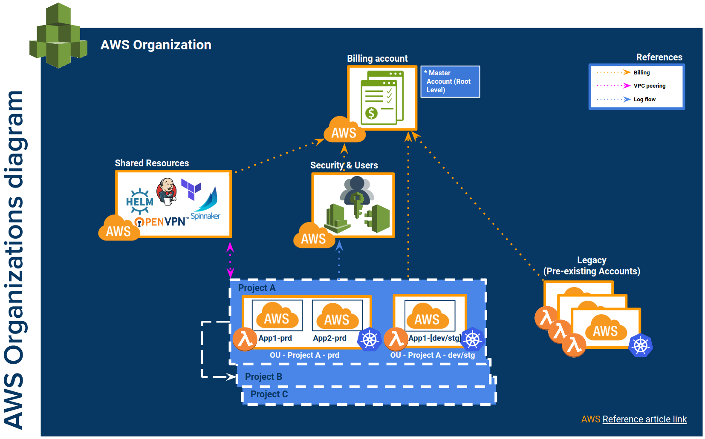

# Reference Architecture: Terraform AWS Organizations Account Baseline

## Overview
This repository contains all Terraform configuration files used to create Binbash Leverage Reference 
[**AWS Organizations**](https://aws.amazon.com/organizations/) Multi-Account baseline layout.

!!! check "Why AWS Organizations?"
    This approach allows it to have a hierarchical structure of AWS accounts, providing additional
    security isolation and the ability to separate resources into Organizational Units with it
    associated Service Control Policies (SCP). 
    
    Considering that a current AWS account/s was/were 
    already active (Client AWS Legacy Account), this one will then be invited to be a “member 
    account” of the AWS Organization architecture. In the future, once all Client’s Legacy dev, 
    stage, prod and other resources for the Project applications are running in the new accounts 
    architecture, meaning a full AWS Organizations approach, all the already migrated assets from 
    the ‘Legacy’ account should be decommissioned. This account will remain with the necessary 
    services, such as DNS, among others. 

## AWS Organization Accounts Layout
The following block provides a brief explanation of the chosen AWS Organization Accounts layout:
```
+ devstg/          (resources for dev apps/services account)
    ...
+ prod/            (resources for prod apps/services account)
    ...
+ root/            (resources for the root-org account)
    ...
+ security/        (resources for the security + users account)
    ...
+ shared/          (resources for the shared account)
    ...
+ legacy/          (resources for the legacy/pre-existing account)
    ...
```

{: style="width:750px"}

**NOTE:** *Image just as reference*

!!! important "Benefits of [**AWS Organizations**](https://aws.amazon.com/organizations/)"
    - [x] **Billing:** Consolidated billing for all your accounts within organization, enhanced per account cost 
    filtering and [RI usage](https://aws.amazon.com/about-aws/whats-new/2019/07/amazon-ec2-on-demand-capacity-reservations-shared-across-multiple-aws-accounts/)  
    - [x] **Security I:** Extra security layer: You get fully isolated infrastructure for different organizations 
    units in your projects, eg: Dev, Prod, Shared Resources, Security, Users, BI, etc.
    - [x] **Security II:** Using AWS Organization you may use Service Control Policies (SCPs) to control which 
    AWS services are available within different accounts.
    - [x] **Networking:** Connectivity and access will be securely setup via VPC peering + NACLS + Sec Groups
     everything with private endpoints only accessible vía Pritunl VPN significantly reducing the surface of attack.
    - [x] **User Mgmt:** You can manage all your IAM resources (users/groups/roles) and policies in one 
    place (usually, security/users account) and use AssumeRole to works with org accounts.
    - [x] **Operations:** Will reduce the **blast radius** to the maximum possible.   
    - [x] **Compatibility:** Legacy accounts can (probably should) be [invited 
         as a member of the new Organization](https://docs.aws.amazon.com/organizations/latest/userguide/orgs_manage_accounts_invites.html)
          and afterwards even imported into your [terraform code](https://www.terraform.io/docs/providers/aws/r/organizations_account.html#import).
    - [x] **Migration:** After having your baseline AWS Org reference cloud solutions architecture deployed
        (IAM, VPC, NACLS, VPC-Peering, DNS Cross-Org,
        CloudTrail, etc.) you're ready to start progressively orchestrating new resources in order to segregate different
        Environment and Services per account.
        This approach will allow you to start a **1 by 1 Blue/Green (Red/Black) migration without affecting any of your 
        services at all**. You would like to take advantage of an Active-Active DNS switchover approach (nice as DR exercise too). 
        - [x] **EXAMPLE:** Jenkins CI Server Migration steps:
              1. Let's say you have your EC2_A (`jenkins.aws.domain.com`) in Account_A (Legacy), so you could deploy a 
                brand new EC2_B Jenkins Instance in Account_B (Shared Resources).
              2. Temporally associated with `jenkins2.aws.domain.com`
              3. Sync it's current data (`/var/lib/jenkins`)
              4. Test and fully validate every job and pipeline works as expected.
              5. In case you haven't finished your validations we highly recommend to declare everything as code and 
                fully automated so as to destroy and re-create your under development env on demand to save costs.
              6. Finally switch `jenkins2.aws.domain.com` -> to -> `jenkins.aws.domain.com`
              7. Stop your old EC2_A.
              8. If everything looks fine after after 2/4 weeks you could terminate your EC2_A (hope everything is as 
                code and just `terraform destroy`)
              9. Considering the previously detailed steps plan your roadmap to move forward with every other component
                to be migrated.

## Read more

!!! info "AWS reference links"
    Consider the following AWS official links as reference:
        
    - :orange_book: [**AWS Multiple Account User Management Strategy**](https://docs.aws.amazon.com/IAM/latest/UserGuide/tutorial_cross-account-with-roles.html)
    - :orange_book: [**AWS Muttiple Account Security Strategy**](https://docs.aws.amazon.com/awscloudtrail/latest/userguide/cloudtrail-sharing-logs.html)
    - :orange_book: [**AWS Multiple Account Billing Strategy**](https://aws.amazon.com/answers/account-management/aws-multi-account-billing-strategy/)
    - :orange_book: [**AWS Secure Account Setup**](https://aws.amazon.com/answers/security/aws-secure-account-setup/)
    - :orange_book: [**Authentication and Access Control for AWS Organizations**](https://docs.aws.amazon.com/organizations/latest/userguide/orgs_permissions.html) (keep in mind EC2 and other services can also use AWS IAM Roles to get secure cross-account access)