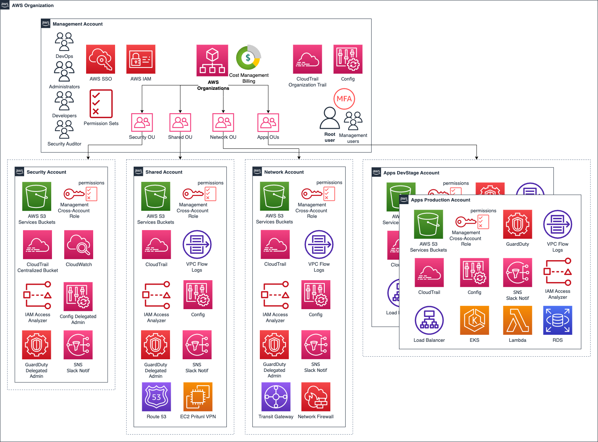

{: style="width:250px"}
{: style="width:130px"}

# Reference Architecture 

!!! info "Overview"
    **Reference Architecture for AWS** has been designed under optimal configs for the most
    popular modern web and mobile applications needs. 
    Its design is fully based on AWS [“Well Architected Framework”](../../work-with-us/support.md).

    Reusing the [**Leverage Infrastructure as Code (IaC) Library**](../infra-as-code-library/infra-as-code-library.md) via
    [**Leverage CLI**](https://github.com/binbashar/leverage) to rapidly implement it.

    It will solve your entire infrastructure and will grant you complete control of the source
    code and of course you'll be able to run it without us.

#### Structural concepts
The Reference Architecture is designed with modularity in mind. A multi-accounts approach is leveraged in order to improve security isolation and resources separation. Furthermore each account infrastructure is divided in smaller units that we call **layers**. Each layer contains all the required resources and definitions for a specific service or feature to function.

Each individual configuration of the Reference Architecture is referred to as a **project**. A Leverage project is comprised of all the relevant accounts and layers.

### Reference Architecture Model
!!! check "Strengths"
    - [x] Faster updates (new features and bug fixes).
    - [x] Better code quality and modules maturity (proven and tested).
    - [x] Supported by Binbash, and public modules even by 1000's of top talented Open Source community 
        contributors.
    - [x] Increase development cost savings.
    - [x] Clients keep full rights to all commercial, modification, distribution, and private use of the code 
        (No Lock-In) through forks inside their own projects' repositories (open-source and commercially reusable via [license MIT and Apache 2.0](https://choosealicense.com/licenses/).

### Reference Architecture Design
#### AWS Organizations multi-account diagram
{: style="width:950px"}
<figcaption style="font-size:15px">
<b>Figure:</b> AWS Organization multi-account reference architecture diagram.
(Source: Binbash Leverage,
"Leverage Reference Architecture components",
Binbash Leverage Doc, accessed August 4th 2021).
</figcaption>

## Read More

!!! info "Related articles"
    * :ledger: [Don't get locked up into avoiding lock-in](https://martinfowler.com/articles/oss-lockin.html)
    * :ledger: [AWS Managed Services](https://aws.amazon.com/managed-services/)