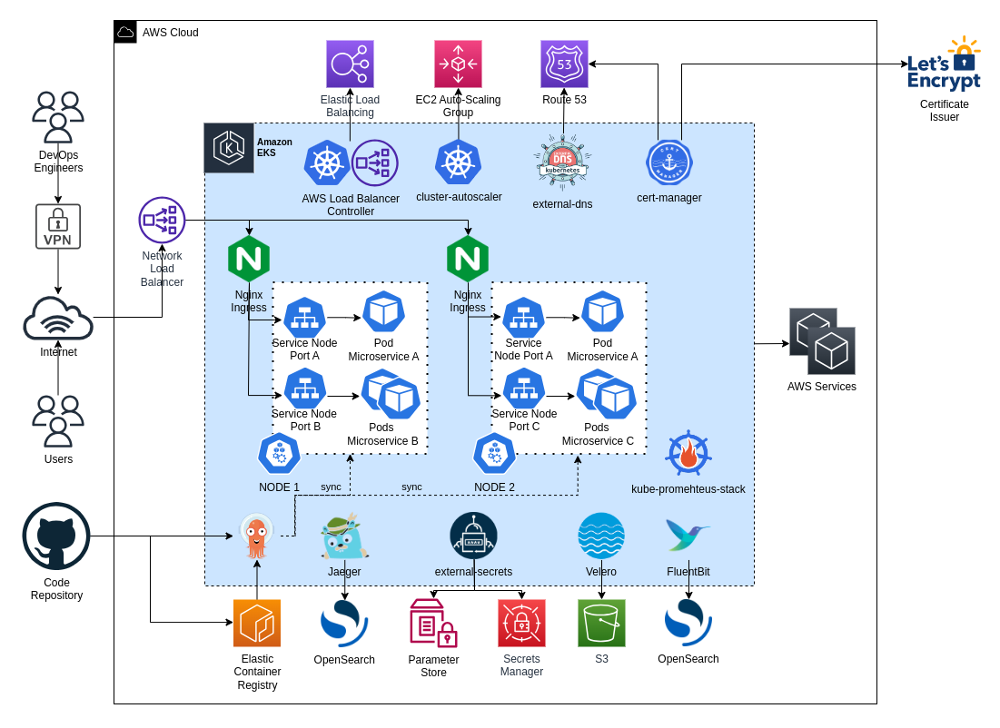

{: style="width:800px"}

# AWS EKS Reference Architecture

## Amazon EKS Resources

### Control Plane (aka. Master Nodes)
This is the primary resource which defines the cluster. We will create one cluster on each
account:

- [x] [apps-devstg/us-east-1/k8s-eks](https://github.com/binbashar/le-tf-infra-aws/tree/master/apps-devstg/us-east-1/k8s-eks)
- [x] [apps-prd/us-east-1/k8s-eks](https://github.com/binbashar/le-tf-infra-aws/tree/master/apps-prd/us-east-1/k8s-eks)

!!! info "Important" 
    In case of multiple environments hosted in the same cluster as for the one with
    Apps Dev and Stage, the workload isolation will be achieved through Kubernetes
    features such as namespaces, network policies, RBAC, and others.

### Data Plane (Worker Nodes)
We have 3 options here: 

- Managed Nodes
- Fargate
- Fargate Spot 

!!! info "Considerations" 
    Each option has its pros and cons with regard to cost, operation complexity, extensibility,
    customization capabilities, features, and management.

    In general we implement Managed Nodes. The main reasons being:
    
    1. They allow a high degree of control in terms of the components we can deploy and the features those components can provide to us. For instance we can run ingress controllers and service mesh, among other very customizable resources.
    2. AWS takes care of provisioning and lifecycle management of nodes which is one less task to worry about.
    3. Upgrading Kubernetes versions becomes much simpler and quicker to perform.
    4. We still can, at any time, start using Fargate and Fargate Spot by simply creating a profile for one or both of them, then we only need to move the workloads that we want to run on Fargate profiles of our choice.

## Amazon EKS Architecture Diagram

### Higl-Level components diagram
{: style="width:750px"}
<figcaption style="font-size:15px">
<b>Figure:</b> K8S EKS reference architecture components diagram.
(Source: binbash Leverage Confluence Doc, 
<a href="https://binbash.atlassian.net/wiki/external/2001403925/ZjY5ZGU3NDYyODNhNDQzYTkxZDdkYTliNzczODRkY2M?atlOrigin=eyJpIjoiYjNmMzYwMTg2YmMyNDc3ODg4YTAwNDM5MjBiYWQ5ZGUiLCJwIjoiYyJ9">
"Implementation Diagrams"</a>,
binbash Leverage Doc, accessed January 5th 2022).
</figcaption>

### Detailed components diagram
{: style="width:750px"}
<figcaption style="font-size:15px">
<b>Figure:</b> K8S EKS reference architecture detailed components diagram.
(Source: binbash Leverage Confluence Doc, 
<a href="https://binbash.atlassian.net/wiki/external/2001403925/ZjY5ZGU3NDYyODNhNDQzYTkxZDdkYTliNzczODRkY2M?atlOrigin=eyJpIjoiYjNmMzYwMTg2YmMyNDc3ODg4YTAwNDM5MjBiYWQ5ZGUiLCJwIjoiYyJ9">
"Implementation Diagrams"</a>,
binbash Leverage Doc, accessed January 5th 2022).
</figcaption>