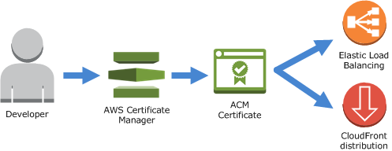

# Certificate Management

## AWS Certificate Manager

!!! info "Why AWS Certificate Manager (ACM)❓"
    As stated at the [official AWS website](https://aws.amazon.com/certificate-manager/)
    
    _"AWS Certificate Manager is a service that lets you easily provision, manage, and deploy public and 
    private Secure Sockets Layer/Transport Layer Security (SSL/TLS) certificates for use with AWS services
    and your internal connected resources. SSL/TLS certificates are used to secure network communications
    and establish the identity of websites over the Internet as well as resources on private networks. 
    AWS Certificate Manager removes the time-consuming manual process of purchasing, uploading, and renewing
    SSL/TLS certificates."_

    _"With AWS Certificate Manager, you can quickly request a certificate, deploy it on 
    [ACM-integrated AWS resources](https://docs.aws.amazon.com/acm/latest/userguide/acm-services.html), 
    such as:_
        
    - Elastic Load Balancers, 
    - Amazon CloudFront distributions, 
    - and APIs on API Gateway,
    
    _and let AWS Certificate Manager handle certificate renewals. It also enables you to create private 
    certificates for your internal resources and manage the certificate lifecycle centrally. 
    Public and private certificates provisioned through AWS Certificate Manager for use with
    ACM-integrated services are free. You pay only for the AWS resources you create to run your application. 
    With AWS Certificate Manager Private Certificate Authority, you pay monthly for the operation of
    the private CA and for the private certificates you issue."_

{: style="width:450px"}
<figcaption style="font-size:15px">
<b>Figure:</b> AWS certificate manager (ACM) service integration diagram.
(Source: AWS, 
<a href="http://docs.aws.amazon.com/acm/latest/userguide/images/acm_intro.png">
"Amazon Certificate Manager intro diagram"</a>,
AWS Documentation Amazon ACM User Guide, accessed August 4th 2021).
</figcaption>

## Cert-manager + Let's Encrypt

!!! info "Why Cert-manager + Let's Encrypt❓"

    - [x] cert-manager adds certificates and certificate issuers as resource types in Kubernetes clusters, and 
    simplifies the process of obtaining, renewing and using those certificates.
    
    - [x] It can issue certificates from a variety of supported sources, including Let’s Encrypt, HashiCorp Vault, and Venafi as well as private PKI.
    
    - [x] It will ensure certificates are valid and up to date, and attempt to renew certificates at a configured time before expiry.
    
    - [x] It is loosely based upon the work of kube-lego and has borrowed some wisdom from other similar projects such as kube-cert-manager.

{: style="width:800px"}
<figcaption style="font-size:15px">
<b>Figure:</b> Certificate manager high level components architecture diagram.
(Source: Cert-manager official documentation, 
<a href="https://cert-manager.io/docs/">
"Cert-manager manager intro overview"</a>,
Cert-manager Documentation main intro section, accessed August 4th 2021).
</figcaption>