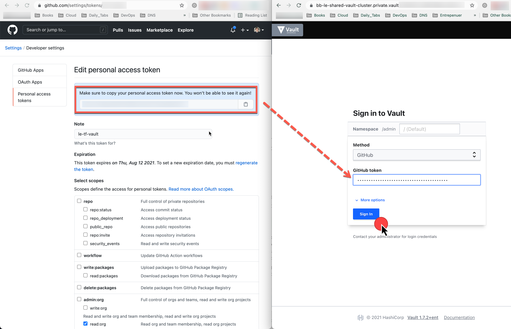

# Hashicorp Vault credentials 

## Hashicorp Vault private API endpoint

If you are on HCP, you can get this from the Admin UI. Otherwise, it will
depend on how you set up DNS, TLS and port settings for your self-hosted
installation. We always favours a private endpoint deployment only accessible
from the VPN.

### AWS Self Hosted Vault Instance Endpoint
`vault_address = "https://vault.aws.binbash.com.ar:8200"`

### HCP Vault private API endpoint
`vault_address = "https://bb-le-shared-vault-cluster.private.vault.xxxxxxxxxx.aws.hashicorp.cloud:8200"`

## Hashicorp Vault token

We'll need to setup this Vault auth token in our [/config/common.config] file whenever we run the 
Terraform Leverage Reference architecture for:

- [x] [le-tf-infra-aws](https://github.com/binbashar/le-tf-infra-aws/blob/master/config/common.config.example)
- [x] [le-tf-vault](https://github.com/binbashar/le-tf-vault/blob/master/config/common.config.example)

!!! info "Vault token generation and authentication"
    Vault token that will be used by Terraform, or vault cli to perform calls to Vault API.
    During the initial setup, you will have to use a root token. If you are
    using a self-hosted installation you will get such token after you initialize
    Vault; if you are using Hashicorp Cloud Platform you can get the token from
    HCP Admin UI.
    
    After the initial setup, and since we recommend integrating Vault to Github for
    authentication, you will have to follow these steps:
       
    1. Generate a GitHub Personal Access Token: [https://github.com/settings/tokens](https://github.com/settings/tokens)
    2. Click “Generate new token“
    3. Under scopes, only select `"read:org"`, under `"admin:org"`
    
    #### Get vault token from your GH auth token
    
    1. Run vault cli vía docker: `docker run -it vault:1.7.2 sh`
    2. Vault ENV vars setup (:ledger: **NOTE:** this will change a little bit between AWS self-hosted vs HCP vault deployment)
          ```
          export VAULT_ADDR="https://vault-cluster.private.vault.XXXXXX.aws.hashicorp.cloud:8200"; \
          export VAULT_NAMESPACE="admin"
          ```
    3. `vault login -method=github`
    ```
    ╭─    ~ ············································································· ✔  at 14:21:27 
    ╰─ docker run -it vault:1.7.2 sh
    / # export VAULT_ADDR="https://bb-le-shared-vault-cluster.private.vault.xxxxxxx.a
    ws.hashicorp.cloud:8200"; export VAULT_NAMESPACE="admin"

    / # vault login -method=github
    GitHub Personal Access Token (will be hidden):
    Success! You are now authenticated. The token information displayed below
    is already stored in the token helper. You do NOT need to run "vault login"
    again. Future Vault requests will automatically use this token.
    
    Key                    Value
    ---                    -----
    token                  s.PNAXXXXXXXXXXXXXXXXXXX.hbtct
    token_accessor         KTqKKXXXXXXXXXXXXXXXXXXX.hbtct
    token_duration         1h
    ...
    ```
    4. input your GH personal access token
    5. Set the returned `token` in step 4) into `/config/common.config` -> `vault_token="s.PNAXXXXXXXXXXXXXXXXXXX.hbtct"`
    
    :ledger: **NOTE:** the admin token from https://portal.cloud.hashicorp.com/ will always work
    but it's use is discouraged for the nominated GH personal access token for
    security audit trail reasons

## Hashicorp Vault UI Auth

You can also manage your Vault instance via its UI. We'll present below screenshot 
to show an example using the Github personal access token, one of our supported auth methods. 

1. Generate a GitHub Personal Access Token: [https://github.com/settings/tokens](https://github.com/settings/tokens)
2. Click “Generate new token“
3. Under scopes, only select `"read:org"`, under `"admin:org"`

Open your preferred web browser choose Github auth method and paste your GH token and you'll be able
to login to your instance.

{: style="width:1200px"}
<figcaption style="font-size:15px">
<b>Figure:</b> Vault HCP UI user authentication screen.
(Source: binbash Leverage,
"Leverage Vault Reference Architecture auth method",
binbash Leverage Doc, accessed August 5th 2021).
</figcaption>

