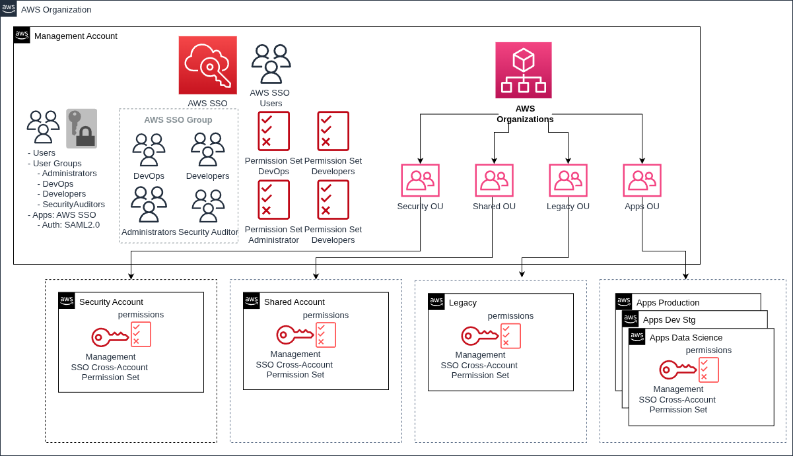

# AWS SSO

TODO Replace JumpCloud with AWS SSO

## Single Sign-On (SSO)
JumpCloud will be configured as the Identity Provider (IdP) that we will integrate with AWS SSO
in order to grant users access to AWS resources from a centralized service.
Users will be able to log in to JumpCloud in order to access AWS accounts, using specific permission sets that will in turn determine what kind of actions they are allowed on AWS resources.

{: style="width:750px"}
<figcaption style="font-size:15px">
<b>Figure:</b> AWS Organization with SSO + JumpCloud IdP diagram.
(Source: binbash Leverage,
"Leverage Reference Architecture components",
binbash Leverage Doc, accessed January 4th 2022).
</figcaption>

### SSO Strengths
- [x] 100% cloud-based
- [x] Secure directory services
- [x] Unified device management
- [x] SSO and user lifecycle management
- [x] Secure app and server authentication with cloud LDAP
- [x] Event logging, reporting, and monitoring

### SSO Users
Users will be defined in JumpCloud and used for deploying AWS resources with scoped permissions.

### SSO Groups
| Account / Groups | Administrators | DevOps | FinOps | SecurityAuditors |
|------------------|----------------|--------|--------|------------------|
| Management       | x              | x      | x      | x                |

!!! Info "Consideration"
        This definition could be fully customized based on the project specific needs

### SSO Permission Sets (w/ Account Associations)
| Account / Permission Sets | Administrator | DevOps | FinOps | SecurityAuditors |
|---------------------------|---------------|--------|--------|------------------|
| Management                | x             |        | x      |                  |
| Security                  | x             | x      |        | x                |
| Shared                    | x             | x      |        | x                |
| Network                   | x             | x      |        | x                |
| Apps-DevStg               | x             | x      |        | x                |
| Apps-Prd                  | x             | x      |        | x                |

!!! Info "Considerations"
     1. Devops Engineers will assume this permission set through JumpCloud + AWS SSO.
     2. Developers could have their specific SSO Group + Permission Set policy association.
     3. This definition could be fully customized based on the project specific needs
