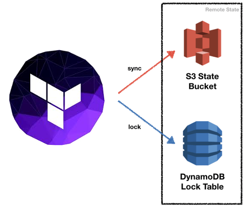

# Terraform - S3 & DynamoDB for Remote State Storage & Locking

## Overview
Use this terraform configuration files to create the **S3 bucket** & **DynamoDB** table needed to use Terraform Remote
State Storage & Locking.

{: style="width:350px"}

<figcaption style="font-size:15px">
<b>Figure:</b> Terraform remote state store & locking necessary AWS S3 bucket and DynamoDB table components.
(Source: Binbash Leverage, 
<a href="https://registry.terraform.io/modules/binbashar/tfstate-backend/aws/latest">
"Terraform Module: Terraform Backend"</a>,
Terraform modules registry, accessed December 3rd 2020).
</figcaption>

## Prerequisites

!!! example "Terraform repo structure + state backend initialization"
    1. Ensure you have `make` installed in your system
    2. Refer to [Configuration Pre-requisites](../base-configuration/repo-le-tf-infra-aws.md) to understand how to set up the
      configuration files required for this layer. Where you must build your
      [Terraform Reference Architecture account structure](../../how-it-works/organization/organization.md)
    3. Leveraged by the [DevOps Automation Code Library](../../how-it-works/code-library/code-library.md) through the
     [terraform-aws-tfstate-backend module](https://registry.terraform.io/modules/binbashar/tfstate-backend/aws/latest)
        - [/root/base-tf-backend](https://github.com/binbashar/le-tf-infra-aws/tree/master/root/base-tf-backend)
        - [/security/base-tf-backend](https://github.com/binbashar/le-tf-infra-aws/tree/master/security/base-tf-backend)
        - [/shared/base-tf-backend](https://github.com/binbashar/le-tf-infra-aws/tree/master/shared/base-tf-backend)
        - [/apps-devstg/base-tf-backend](https://github.com/binbashar/le-tf-infra-aws/tree/master/apps-devstg/base-tf-backend)
        - [/apps-prd/base-tf-backend](https://github.com/binbashar/le-tf-infra-aws/tree/master/apps-prd/base-tf-backend)

## Set up

!!! example "Steps to initialize your tf-backend"
    1. At the root context of the *Terraform Reference Architecture account structure* run `make init-makefiles`
        ```
        ╭─delivery at delivery-ops in ~/Binbash/repos/Leverage/ref-architecture/le-tf-infra-aws on master✘✘✘ 20-12-02 - 10:30:31
        ╰─⠠⠵ make init-makefiles 
        ...
        mkdir -p ./@bin/makefiles
        git clone https://github.com/binbashar/le-dev-makefiles.git ./@bin/makefiles -q
        cd ./@bin/makefiles && git checkout v0.1.7 -q
    
        ```
    2. At the corresponding account dir, 
      eg: [/shared/base-tf-backend](https://github.com/binbashar/le-tf-infra-aws/tree/master/shared/base-tf-backend) then,
    3. Run `make init`
    4. Run `make plan`, review the output to understand the expected changes
    5. Run `make apply`, review the output once more and type `yes` if you are okay with that
    6. This should create a `terraform.tfstate` file in this directory but we don't want to push that to the repository so 
      let's push the state to the backend we just created
        
        - Open `config.tf` and uncomment the following lines:
        ```
          # backend "s3" {
          #   key = "root/tf-backend/terraform.tfstate"
          # }
        ```
        - Run `make init` and type `yes` when Terraform asks if you want to import the state to the S3 backend
        - Done. You can remove `terraform.tfstate` now (and also `terraform.tfstate.backup` if available)

## Expected workflow after set up 
[](https://asciinema.org/a/377220)