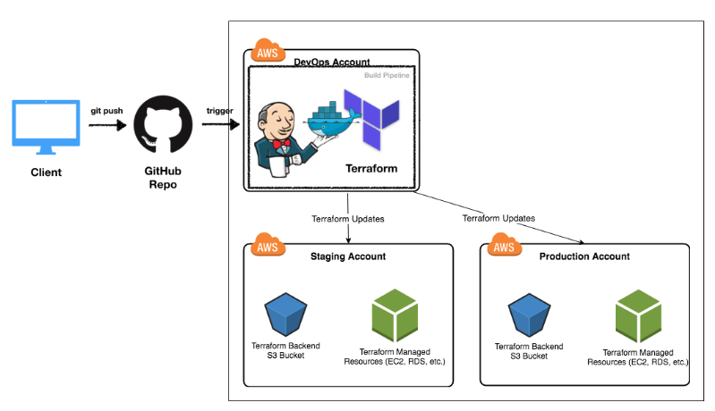

# Workflow

## Steps 
!!! check "Terraform Workflow"
    1. Make sure you've read and prepare your local development environment following the
    [Overview base-configurations](../base-configuration/overview.md) section.
    2. Depending in which Terraform Ref Architecture repo you are working please review and assure you meet
    all the [terraform aws pre-requisites](../base-configuration/repo-le-tf-infra-aws.md) or 
    [terraform vault pre-requisites](../base-configuration/repo-le-tf-vault.md)  
        - [x] [Remote State](repo-le-tf-infra-aws-tf-state.md)
        - [x] Configuration files
        - [x] [AWS Profile and credentials](../identities/credentials.md)
        - [x] [Vault token secret](../identities/credentials-vault.md)
    3. Get into the folder that you need to work with (e.g. `2_identities`)
    4. Run `leverage terraform init`
    5. Make whatever changes you need to make
    6. Run `leverage terraform plan` if you only mean to preview those changes
    7. Run `leverage terraform apply` if you want to review and likely apply those changes

!!! note 
    If desired at step **#5** you could submit a PR, allowing you and the rest of the team to 
    understand and review what changes would be made to your AWS Cloud Architecture components before executing 
    `leverage terraform apply` (`terraform apply`). This brings the huge benefit of treating changes with a **GitOps** oriented 
    approach, basically as we should treat any other code & infrastructure change, and integrate it with the 
    rest of our tools and practices like CI/CD, in

## Running in Automation
{: style="width:350"}
<figcaption style="font-size:15px">Figure: Running terraform with AWS in automation (just as reference).</figcaption>

## Read More

!!! info "Extra resources"
    * :ledger: [Running Terraform in automation](https://learn.hashicorp.com/terraform/development/running-terraform-in-automation)
    
