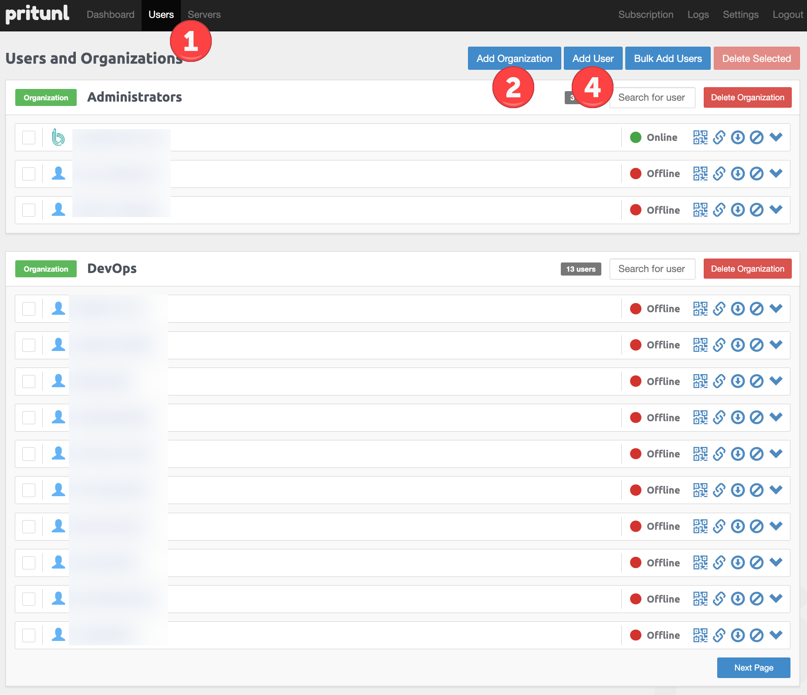
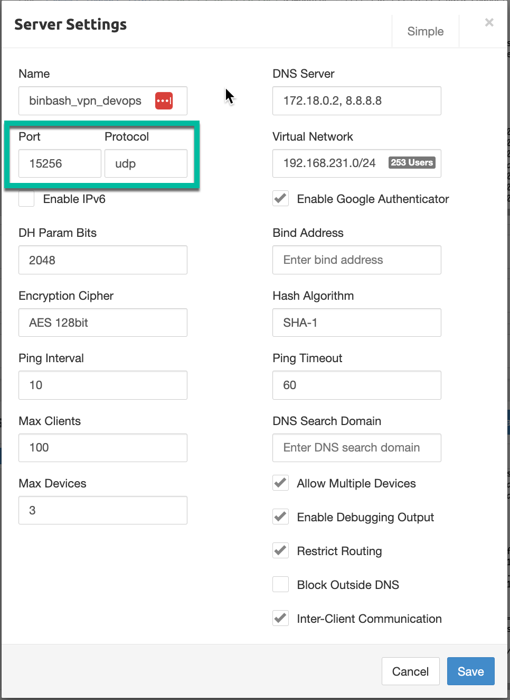
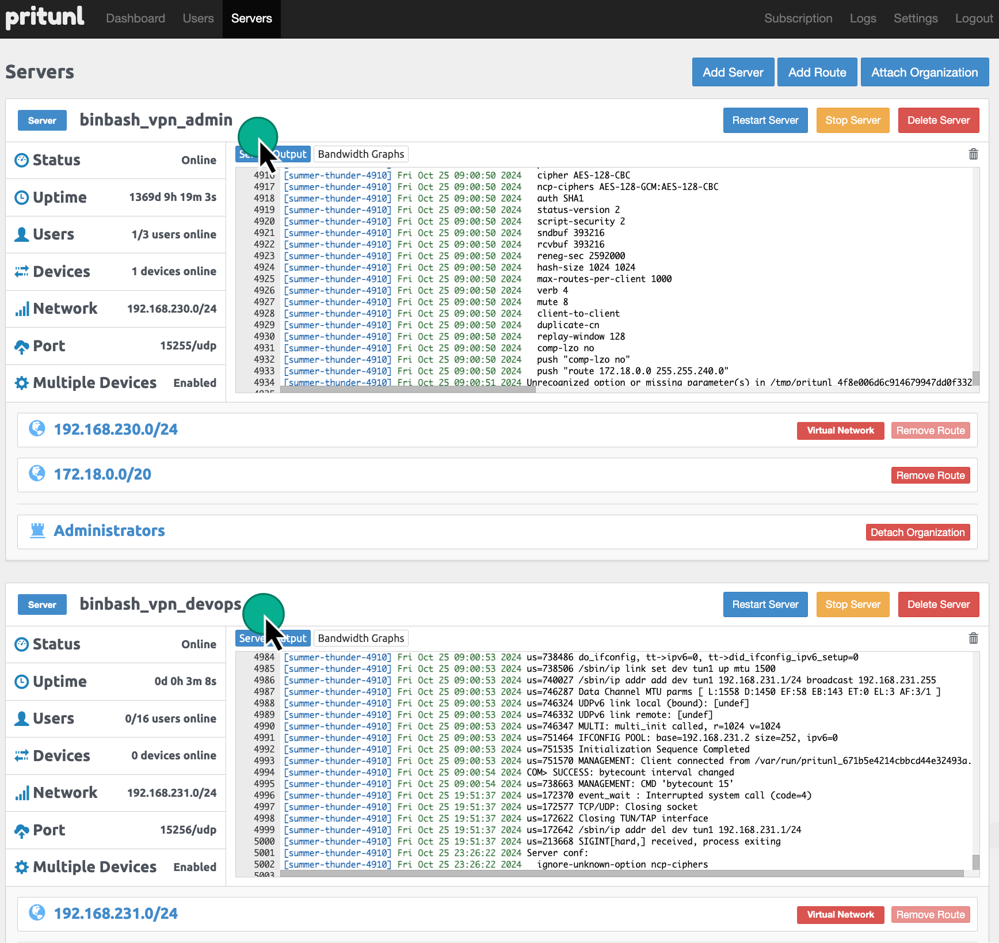
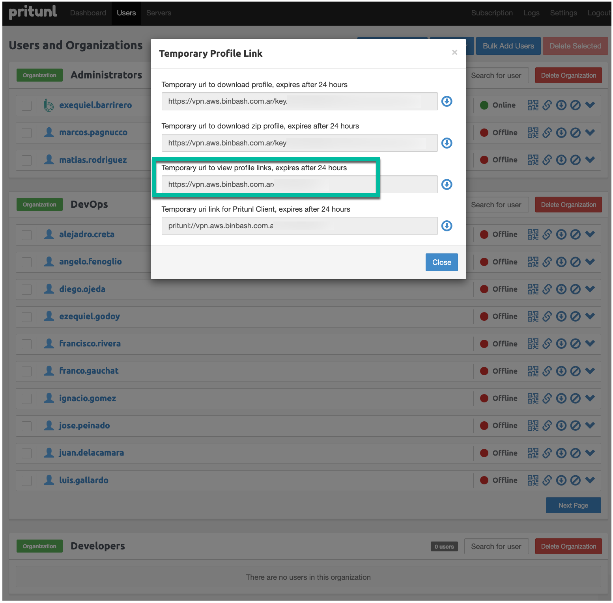
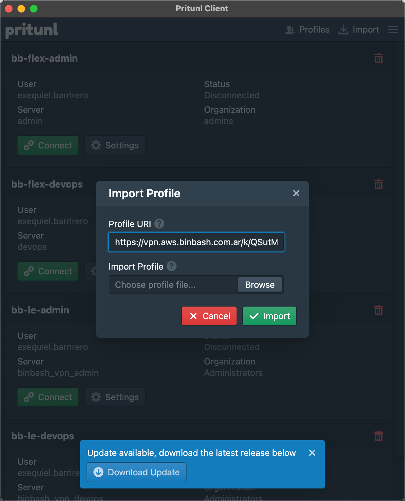

# Configuring Pritunl

## Overview
At this point you should have provisioned the infrastructure and software required to run Pritunl.
Now it's time to apply the finishing steps.

## Connecting to Pritunl Web Admin

Browse to the Pritunl URL. In our case that's [https://vpn.aws.binbash.com.ar](https://vpn.aws.binbash.com.ar) but in yours the domain will probably be different.

!!! Note "Access via IP Address"  
    In case you still don't have your DNS record you can access via public IP Address
The first time you access Pritunl's Web Admin, it should guide you through the initialization process which consists of setting up the database and then the admin password.

{: style="width: 450px"}
<figcaption style="font-size:15px">
<b>Figure:</b> Pritunl Database Setup screen
</figcaption>

This initialization usually requires using SSH to log into the instance and then running a few simple commands.

The command below should get you the setup key which is used for configuring the database (MongoDB):

```shell
sudo pritunl setup-key
```

And then the next command should get you the initial password:

```shell
sudo pritunl default-password
```

!!! Note "About the initialization commands"
    The above commands might change in future versions so it's recommended to follow the instructions
    presented by Pritunl's Web Admin instead.


## Setting up TLS

In the initial setup screen, you can fill the "Lets Encrypt Domain" field and then click "Save".
That should have Pritunl talk to Let's Encrypt in order to have a TLS certificate issued for your Pritunl instance.

{: style="width: 450px"}
<figcaption style="font-size:15px">
<b>Figure:</b> Pritunl Initial Setup screen
</figcaption>

!!! Note "Pritunl Documentation"
    We highly encourage you to read more about the initial setup in [Pritunl's official documentation](https://docs.pritunl.com/docs/configuration-5#initial-setup).

## Create users and organizations

First things first, add a user.

1. Go to the "Users" menu.
2. Click on "Add Organization".
3. Type a name and click "Add".
4. Now click on "Add User".
5. Enter a name, select the organization, enter an email and leave the pin empty. 
6. Click Add.

{: style="width: 650px"}
<figcaption style="font-size:15px">
<b>Figure:</b> Pritunl VPN Users web interface.
</figcaption>

## Adding a new server

Now add a server to log into.

1. Go to Servers and hit "Add Server".
2. Enter the name, check "Enable Google Authenticator" and add it.

    !!! info "IMPORTANT Regarding VPN UPD Port Setup"
        Note the Port and Protocol has to be in the range stated in the VPN Server 
        layer, in the [`ec2.tf`](https://github.com/binbashar/le-tf-infra-aws/blob/2d573360a60f1ca48019bd00f845236d6127cfb0/shared/us-east-1/tools-vpn-server/ec2.tf#L68) file under this block:
        ```terraform
        {
          from_port   = 15255, # Pritunl VPN Server public UDP service ports -> pritunl.server.admin org
          to_port     = 15257, # Pritunl VPN Server public UDP service ports -> pritunl.server.devops org
          protocol    = "udp",
          cidr_blocks = ["0.0.0.0/0"],
          description = "Allow Pritunl Service"
        }
        ```

3. Hit Attach Organization and attach the organization you've created.
4. Hit Attach.
5. Now hit Start Server.

    {: style="width: 450px"}
    <figcaption style="font-size:15px">
    <b>Figure:</b> Pritunl VPN Server Configurations.
    </figcaption>

In general we setup 2 Virtual Servers one for Administration and the other one for the DevOps Engineers as 
show below:

{: style="width: 650px"}
<figcaption style="font-size:15px">
<b>Figure:</b> Pritunl VPN Administrator & DevOps Servers.
</figcaption>

- :books: [OFFICIAL DOC: Config Server & Connect](https://docs.pritunl.com/docs/connecting)
 
## A note on AWS private DNS

To use a Route53 private zone (where your private addresses are set), these steps have to be followed:

1. Edit the server 
2. In the "DNS Server" box (where `8.8.8.8` is set) add the internal DNS for the VPC
  1. the internal DNS is x.x.x.2, e.g. if the VPC in which your VPN Server is is 172.18.0.0/16, then your DNS is 172.18.0.2
  2. for the example, the final text is `172.18.0.2, 8.8.8.8` (note we are adding the `8.8.8.8` as a secondary DNS)
3. Add a specific route for the DNS server, for the example `172.18.0.2/32`
4. Then add all the other routes you need to access your resources, e.g. to access the VPN Server's VPC this route must be added: `172.18.0.0/16`

### Setup new users VPN client 

1. Go to Users.
2. Click the chain icon (Temporary Profile Link) next to the user.
3. Copy the "Temporary url to view profile links, expires after 24 hours" link and send it to the user.

    {: style="width: 550px"}
    <figcaption style="font-size:15px">
    <b>Figure:</b> Pritunl VPN client links.
    </figcaption>

4. The user should open the link.
5. The user has to create an OTP with an app such as Authy, enter a PIN, copy the "Profile URI Link" and enter it in the
"import > profile URI" in the Pritunl Client.

    {: style="width: 550px"}
    <figcaption style="font-size:15px">
    <b>Figure:</b> Pritunl VPN client setup.
    </figcaption>

6. Start the VPN and enjoy being secure!

- :NOTEPAD: [Leverage Ref Arch inline comments doc](https://github.com/binbashar/le-tf-infra-aws/blob/2d573360a60f1ca48019bd00f845236d6127cfb0/shared/us-east-1/tools-vpn-server/ec2.tf#L97)

## Setting back security

Set back all the configurations to access the server and apply the layer:

```terraform
    {
      from_port = 22, # SSH
      to_port   = 22,
      protocol  = "tcp",
      #cidr_blocks = ["0.0.0.0/0"],
      cidr_blocks = [data.terraform_remote_state.vpc.outputs.vpc_cidr_block],
      description = "Allow SSH"
    },
    
  /*  dns_records_public_hosted_zone = [{
    zone_id = data.terraform_remote_state.dns.outputs.aws_public_zone_id[0],
    name    = "vpn.aws.binbash.co",
    type    = "A",
    ttl     = 300
  }]*/

    {
      from_port = 443, # Pritunl VPN Server UI
      to_port   = 443,
      protocol  = "tcp",
      #cidr_blocks = ["0.0.0.0/0"], # Public temporally accessible for new users setup (when needed)
      cidr_blocks = [data.terraform_remote_state.vpc.outputs.vpc_cidr_block],
      description = "Allow Pritunl HTTPS UI"
    },
```

## Note about Routes

When you create a Pritunl VPN server, a VPN network CIDR is used, let's say `192.168.122.0/24`.

So, all the clients connecting to the VPN will be assigned with an IP in this range.

The VPN Server, at the same time, is living in a network, with its own IP in a given range, e.g. `10.20.0.0/16`, and it has a public IP.

Clients will be connecting to the public IP and receiving a VPN IP.

Now, we need to route the traffic. 

Let's say you have an internal network (to which the VPN Server has access) in the range `10.40.0.0/16`.

If you want the VPN clients to reach this network, you must Add a Route to the VPN server.

1. Go to the Servers page.
2. **Stop the server** you want to add the route to. Consider you'll be kicked-out if you're cx to the same server you're working on.
3. Hit Add Route.
4. Fill the CIDR (e.g. `192.168.69.0/24`), select the server name and hit Attach.
5. Start the server.

!!! warning "Important Considerations About Routes" 
    1. Also note the route `0.0.0.0./0` is added by default. This means all traffic go through the VPN server.
    We strongly RECOMMEND You can remove this and allow just the internal CIDRs.
    2. Every time you create a new VPC that has private subnets that you would like to reach you'll
    need to repeat this process.

## Lets Encrypt Domain Renewal

1. must temporally open port 80 to the world (line 52)
2. must temporally open port 443 to the world (line 59)
3. must uncomment public DNS record block (lines 105-112)
4. make apply
5. connect to the VPN and ssh to the Pritunl EC2
6. run '$sudo pritunl reset-ssl-cert'
7. force SSL cert update (manually via UI or via API call)
  in the case of using the UI, set the "Lets Encrypt Domain" field with the vpn domain and click on save
8. rollback steps a,b & c + make apply

This process is also documented in the code [here](https://github.com/binbashar/le-tf-infra-aws/blob/2d573360a60f1ca48019bd00f845236d6127cfb0/shared/us-east-1/tools-vpn-server/ec2.tf#L86) 
