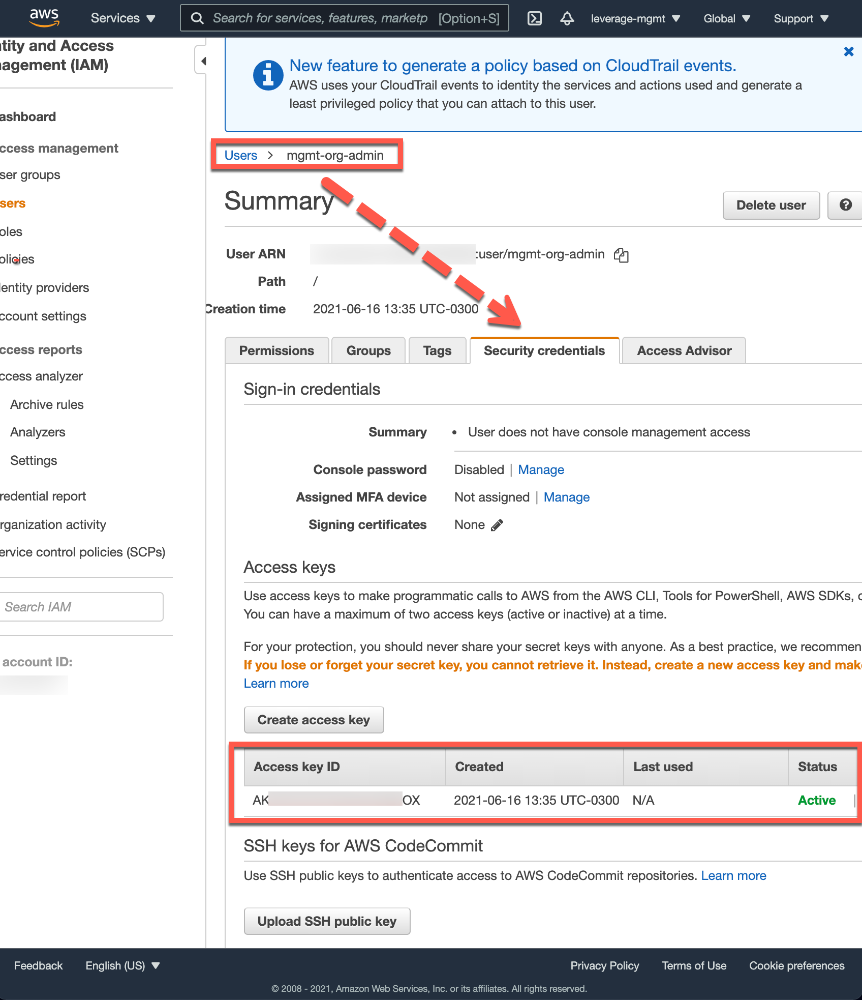

# Reference Architecture: Terraform AWS Organizations account baseline

!!! help "How it works"
    :books: [**documentation:** organization](../../how-it-works/organization/organization.md)
    
    :books: [**documentation:** organization accounts](../../how-it-works/organization/accounts.md)

## User guide

### Pre-requisites

You'll need an email to [create and register your AWS Organization Root Account](https://aws.amazon.com/premiumsupport/knowledge-center/create-and-activate-aws-account/).
For this purpose we recommend to avoid using a personal email account. 
Instead, whenever possible, it should ideally be associated, with a **distribution list email** such as a 
[**GSuite Group**](https://support.google.com/a/answer/2727156?hl=en) to ensure the proper admins member's team 
(DevOps | SecOps | Cloud Engineering Team) to manage its notifications avoiding a single point of contact (constraint).

#### Email setup example
**GSuite Group Email address:** `aws@domain.com` (to which admins / owners belong), and then using the `+` we generate
the aliases automatically implicitly when running Terraform's Leverage code.

* :e-mail: `aws+security@binbash.com.ar`
* :e-mail: `aws+shared@binbash.com.ar`
* :e-mail: `aws+network@binbash.com.ar`
* :e-mail: `aws+apps-devstg@binbash.com.ar`
* :e-mail: `aws+apps-prd@binbash.com.ar`

!!! important "Reference Code as example"
    ```terraform
    #
    # Project Prd: services and resources related to production are placed and
    #  maintained here.
    #
    resource "aws_organizations_account" "apps_prd" {
      name      = "apps-prd"
      email     = "aws+apps-prd@doamin.ar"
      parent_id = aws_organizations_organizational_unit.apps_prd.id
    }
    ```

### Reference AWS Organization init workflow

!!! example "Steps for initial AWS Orgnization setup"
    1. Create a brand [new AWS Account](https://aws.amazon.com/premiumsupport/knowledge-center/create-and-activate-aws-account/),
     intended to be our AWS Organization Management (root) Account
        - [x] **Name:** `project_name-management`, eg: `leverage-management`
        - [x] **MFA:** [Enable MFA for your root user](https://docs.aws.amazon.com/IAM/latest/UserGuide/id_root-user.html#id_root-user_manage_mfa)
        - [x] **Billing:** review billing setup as pre-requisite to deploy the AWS Org. 
          At your [Management account billing setup](https://console.aws.amazon.com/billing/home?#/account) 
          check
            - Activate IAM User and Role Access to Billing Information
            - If needed Update Alternate Contacts 

    2. Via AWS Web Console: in `project_name-management` previously created account (eg, name: `leverage-management`,
    email: `aws@binbash.com.ar`) [create the `mgmt-org-admin` IAM user with Admin privileges](https://docs.aws.amazon.com/mediapackage/latest/ug/setting-up-create-iam-user.html)
    (admin IAM policy attached), which will be use for the initial AWS Org bootstrapping.
        - :ledger: **NOTE:** After it’s 1st execution only nominated Org admin users will persist in the `project-mgmt` account.

    3. Via AWS Web Console: in `project-management` account create `mgmt-org-admin` IAM user AWS ACCESS KEYS
        - :ledger: **NOTE:** This could be created all in one in the previous step (Nº 2).

        {: style="width:950px"}
        <figcaption style="font-size:15px">
        <b>Figure:</b> AWS Web Console screenshot.
        (Source: Binbash, "AWs Organization management account init IAM admin user", accessed June 16th 2021).
        </figcaption>
    
        {: style="width:950px"}
        <figcaption style="font-size:15px">
        <b>Figure:</b> AWS Web Console screenshot.
        (Source: Binbash, "AWs Organization management account init IAM admin user", accessed June 16th 2021).
        </figcaption>

    4. Set your IAM credentials in the machine your're going to exec the `leverage cli` (remember this are the 
    `mgmt-org-admin` temporary user credentials shown in the screenshot immediately above).

    5. Set up your Leverage reference architecture configs in order to work with your new account and 
    `org-mgmt-admin IAM user
        - [common config](https://github.com/binbashar/le-tf-infra-aws/blob/master/config/common.config.example)
        - [account configs](https://github.com/binbashar/le-tf-infra-aws/tree/master/root/config)

    6. Setup and create the **terraform remote state** for the new AWS Org Management account
        - [x] [terraform remote state config](https://leverage.binbash.com.ar/user-guide/base-configuration/repo-le-tf-infra-aws/#remote-state)
        - [x] [terraform remote state workflow](https://leverage.binbash.com.ar/user-guide/base-workflow/repo-le-tf-infra-aws-tf-state/)
        - [x] [terraform remote state ref code](https://github.com/binbashar/le-tf-infra-aws/tree/master/root/base-tf-backend)
        - :ledger: You'll 1st get a local state and then you'll need to move your tf state to s3; validate it and finally delete local state files

    7. The AWS Organization from the Reference Architecture 
    [/le-tf-infra-aws/root/organizations](https://github.com/binbashar/le-tf-infra-aws/tree/master/root/organizations) 
    will be orchestrated using the `leverage cli` following the 
    [standard workflow](../../base-workflow/repo-le-tf-infra-aws/#steps).
        - :ledger: the Management account has to be imported into de the code.

    8. Verify your Management account email address in order to invite existing (legacy) AWS accounts to 
    join your organization.

## Organization setup post-steps

!!! example "AWS Organization setup post-steps"
    1. Following the [doc](../identities/identities.md) orchestrate vía the `leverage cli` workflow the Mgmt 
    Account IAM layer (`base-identities`) with the admin IAM Users (consider this/these users will have admin privileges over the 
    [entire AWS Org assuming the `OrganizationAccountAccessRole`](https://docs.aws.amazon.com/organizations/latest/userguide/orgs_manage_accounts_access.html))
    -> [le-tf-infra-aws/root/base-identities](https://github.com/binbashar/le-tf-infra-aws/tree/master/root/base-identities)
        - :ledger: The IAM role: `OrganizationAccessAccountRole` => does not exist in the initial Management (root)
    account, this will be created by the code in this layer.

    2. Mgmt account admin user permanent credentials set up => 
    [setup in your workstation the AWS credentials](../identities/identities.md))
    for the `OrganizationAccountAccessRole` IAM role (`project_short-root-oaar`, eg: `bb-root-oaar`).
    Then validate within each initial mgmt account layer that the profile `bb-root-oaar` is correcly configured 
    at the below presented config files, as well as any other necessary setup.
        - [`/config/common.config`](https://github.com/binbashar/le-tf-infra-aws/blob/master/config/common.config.example) 
        - [`/root/config/account.config`](https://github.com/binbashar/le-tf-infra-aws/blob/master/root/config/account.config)
        - [/root/config/backend.config`](https://github.com/binbashar/le-tf-infra-aws/blob/master/root/config/backend.config)
    3. Setup (code and config files) and Orchestrate the 
    [`/security/base-identities`](https://github.com/binbashar/le-tf-infra-aws/tree/master/security/base-identities) 
    layer via `leverage cli` on your security account
    for consolidated and centralized User Mgmt and access to the AWS Org.    
    
    4. [AWS Organizations: invite pre-existing (legacy) accounts](./organization-legacy-accounts.md)

    - :ledger: Pending to document the debug mode for the mfa script

