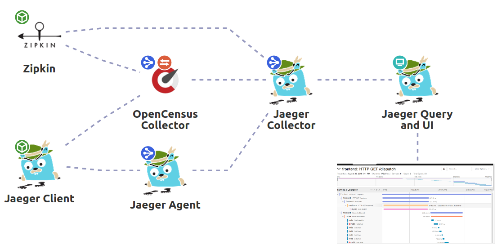

# Distributed Tracing 

!!! info "Solution Design"
    Distributed tracing, also called distributed request tracing, is a method used to profile and monitor applications,
    especially those built using a microservices architecture. Distributed tracing helps pinpoint where failures occur
    and what causes poor performance.

{: style="width:750px"}
<figcaption style="font-size:15px">
<b>Figure:</b> Figure: Distributed tracing architecture diagram (just as reference).
(Source: binbash Leverage, 
<a href="https://drive.google.com/file/d/1KYZC-wTXn2PSVIEtikx9PFOwK2SoCxD8/view?usp=sharing">
"AWS Well Architected Reliability Report example"</a>,
binbash Leverage Doc, accessed November 18th 2020).
</figcaption>
 
## Read more
 
!!! info "Related resources"    
    * :ledger: [Jaeger](https://www.jaegertracing.io/) 
    * :ledger: [Opensensus](https://opencensus.io/)
