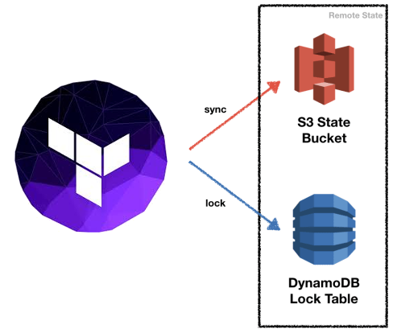

# Terraform - S3 & DynamoDB for Remote State Storage & Locking

## Overview
Use this terraform configuration files to create the **S3 bucket** & **DynamoDB** table needed to use Terraform Remote State Storage & Locking.

!!! info "What is the Terraform Remote State?"
    Read the [official definition](https://developer.hashicorp.com/terraform/language/state/remote) by Hashicorp.

{: style="width:350px"}

<figcaption style="font-size:15px">
<b>Figure:</b> Terraform remote state store & locking necessary AWS S3 bucket and DynamoDB table components.
(Source: binbash Leverage, 
<a href="https://registry.terraform.io/modules/binbashar/tfstate-backend/aws/latest">
"Terraform Module: Terraform Backend"</a>,
Terraform modules registry, accessed December 3rd 2020).
</figcaption>

## Prerequisites

!!! example "Terraform repo structure + state backend initialization"
    1. Ensure you have [`Leverage CLI`](../../user-guide/leverage-cli/overview.md) installed in your system
    2. Refer to [Configuration Pre-requisites](./configuration.md) to understand how to set up the
      configuration files required for this layer. Where you must build your
      [Terraform Reference Architecture account structure](features/organization/overview.md)
    3. Leveraged by the [Infrastructure as Code (IaC) Library](../../user-guide/infra-as-code-library/overview.md) through the
     [terraform-aws-tfstate-backend module](https://registry.terraform.io/modules/binbashar/tfstate-backend/aws/latest)
        - [/management/base-tf-backend](https://github.com/binbashar/le-tf-infra-aws/tree/master/root/us-east-1/base-tf-backend)
        - [/security/base-tf-backend](https://github.com/binbashar/le-tf-infra-aws/tree/master/security/us-east-1/base-tf-backend)
        - [/shared/base-tf-backend](https://github.com/binbashar/le-tf-infra-aws/tree/master/shared/us-east-1/base-tf-backend)
        - [/network/base-tf-backend](https://github.com/binbashar/le-tf-infra-aws/tree/master/network/us-east-1/base-tf-backend)
        - [/apps-devstg/base-tf-backend](https://github.com/binbashar/le-tf-infra-aws/tree/master/us-east-1/apps-devstg/base-tf-backend)
        - [/apps-prd/base-tf-backend](https://github.com/binbashar/le-tf-infra-aws/tree/master/apps-prd/us-east-1/base-tf-backend)

## Set up

!!! example "Steps to initialize your tf-backend"
    1. At the corresponding account dir, 
      eg: [/shared/base-tf-backend](https://github.com/binbashar/le-tf-infra-aws/tree/master/shared/us-east-1/base-tf-backend) then,
    2. Run `leverage terraform init --skip-validation`
    3. Run `leverage terraform plan`, review the output to understand the expected changes
    4. Run `leverage terraform apply`, review the output once more and type `yes` if you are okay with that
    5. This should create a `terraform.tfstate` file in this directory but we don't want to push that to the repository so 
      let's push the state to the backend we just created
        
        - Open `config.tf` and uncomment the following lines:
        ```
          # backend "s3" {
          #   key = "shared/tf-backend/terraform.tfstate"
          # }
        ```
        - Run `leverage terraform init` and type `yes` when Terraform asks if you want to import the state to the S3 backend
        - Done. You can remove `terraform.tfstate` now (and also `terraform.tfstate.backup` if available)

## Expected workflow after set up 
:warning: This video is outdated!
[](https://asciinema.org/a/377220)

# Terraform Remote State
In the `base-tf-backend` folder you should find the definition of the infrastructure that needs to be deployed before 
you can get to work with anything else.

**IMPORTANT:** THIS IS ONLY NEEDED IF THE BACKEND WAS NOT CREATED YET. IF THE BACKEND ALREADY EXISTS YOU JUST USE IT.
