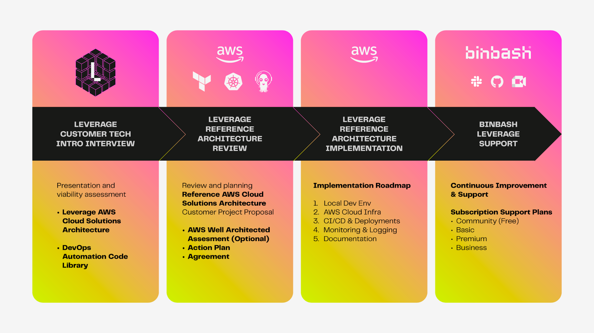

# Work with us

## Customers collaboration methodology  

{: style="width:1200px"}

!!! info "What are all the steps of an engagement"
    - [x] **1st Stage:** Leverage Customer Tech Intro Interview
        1. Complete our [Binbash Leverage project evaluation form](https://docs.google.com/forms/d/e/1FAIpQLScgYmguLk5lDgrDa7HEt8hZFsRKncCf0XMezbDRsXt4mixg4Q/viewform?usp=sf_link) 
       so we can get to know your project, find out if you're a good fit and get in contact with you. 
        2. Schedule a tech intro interview meeting to understand which are your exact challenges and do a Leverage
       Reference Architecture feasibility assessment.
    - [x] **2nd Stage:** Leverage Reference Architecture Review
        1. If we can contribute, we'll execute a Mutual NDA (ours or yours), then walk your through to complete our
        [Binbash Leverage due diligence for Reference Architecture form](https://docs.google.com/forms/d/e/1FAIpQLSf4wfZI54v9yWmQBq53NPQVvipBCKHiBvAz4A0as6_mdeeGDQ/viewform?usp=sf_link).
        2. Once we completely understand your requirements we'll prepare a comprehensive proposal including the complete
       [**"Leverage Implementation Action Plan Roadmap"**](./faqs/#assignments-and-delivery) (also known as Statement 
       of Work - SOW) detailing every task for the entire project. 
        3.  After you review it and we agree on the general scope, a Services Agreement (SA) is signed.
        4. The [project kick-off](./faqs/#project-kick-off) day is scheduled. 
    - [x] **3rd Stage:** Leverage Ref Architecture Implementation 
        1. The Roadmap (SOW) is executed, we'll send an invoice for the deposit and first Sprint starts.
    - [x] **4rth Stage:** Binbash Leverage Support
        1. During and after finishing the complete Roadmap we'll provide commercial support, maintenance
           and upgrades for our work over the long term.
       
### Work methodology intro video
<iframe width="560" height="315" src="https://www.youtube.com/embed/Fl-t9Acr6o8" title="YouTube video player" frameborder="0" allow="accelerometer; autoplay; clipboard-write; encrypted-media; gyroscope; picture-in-picture" allowfullscreen></iframe>

## Customer Support workflow  
{: style="width:1200px"}

## Read More

!!! info "Related articles"
    * :ledger: [FAQs | Agreement and statement of work](./faqs/#agreement-and-statement-of-work)
